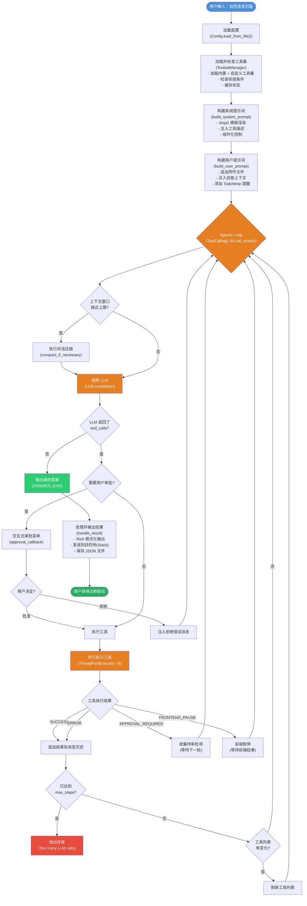
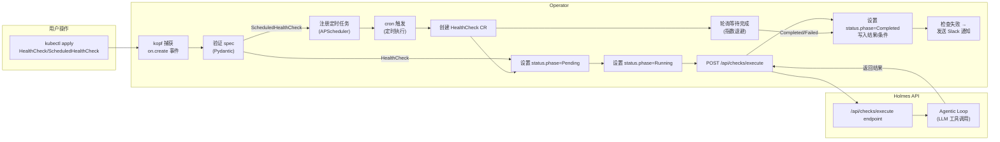

# HolmesGPT 代码架构分析文档

> 本文档面向刚接手 HolmesGPT 项目的开发人员，系统性地说明 `holmes/`（核心引擎）和 `holmes_operator/`（Kubernetes Operator）两个代码库的架构设计、模块职责和关键流程。

---

## 目录

1. [项目概述](#1-项目概述)
2. [系统功能概述](#2-系统功能概述)
   - 我能用 HolmesGPT 做什么？
   - 系统核心能力
3. [系统架构图](#3-系统架构图)
4. [系统流程图](#4-系统流程图)
   - Operator 侧流程
5. [holmes/ — 核心引擎架构](#5-holmes--核心引擎架构)
   - 5.1 顶层入口与 CLI
   - 5.2 配置系统
   - 5.3 LLM 调用引擎（Agentic Loop）
   - 5.4 工具集系统
   - 5.5 提示词系统
   - 5.6 插件体系
   - 5.7 检查系统（Checks API）
   - 5.8 服务端（FastAPI）
   - 5.9 其他子系统
6. [holmes_operator/ — K8s Operator 架构](#6-holmes_operator--kubernetes-operator-架构)
   - 6.1 CRD 数据模型
   - 6.2 Operator 入口与生命周期
   - 6.3 全局上下文
   - 6.4 事件处理器
   - 6.5 调度器
   - 6.6 API 客户端
   - 6.7 工具函数
   - 6.8 配置
7. [两者关系与通信](#7-两者关系与通信)
8. [开发指南](#8-开发指南)

---

## 1. 项目概述

HolmesGPT 是一个 AI 驱动的故障排查助手，连接到可观测性平台（Kubernetes、Prometheus、Grafana、Elasticsearch 等），通过 Agentic Loop 自动诊断和分析基础设施及应用问题。
项目包含两个部分：
| 模块 | 目录 | 职责 |
|------|------|------|
| **核心引擎** | `holmes/` | CLI、LLM 调用、工具调用、插件体系、REST API |
| **K8s Operator** | `holmes_operator/` | CRD 控制器，通过 kopf 框架管理 HealthCheck 和 ScheduledHealthCheck 资源 |

---

## 2. 系统功能概述

HolmesGPT 本质上是一个 **连接了可观测性工具的 AI 代理**。用户通过自然语言提问，HolmesGPT 自主决定调用哪些工具获取数据，分析结果，最终给出诊断结论。以下是它的核心功能场景：

### 我能用 HolmesGPT 做什么？

**场景一：直接提问（`holmes ask`）**
> 用户输入："检查我的 Kubernetes 集群中是否有异常 Pod，以及它们的日志中有没有错误信息。"
> HolmesGPT 会：调用 Kubernetes 工具集列出异常 Pod → 调用日志工具集获取相关日志 → 综合分析 → 返回排查结果。

**场景二：自动调查告警（`holmes investigate alertmanager`）**
> 当 Prometheus AlertManager 产生告警时，HolmesGPT 自动获取告警详情，关联查询 Prometheus 指标、Grafana 仪表盘、Pod 日志等多方数据，给出告警根因分析和修复建议。

**场景三：自动调查工单（`holmes investigate jira/github/pagerduty/opsgenie`）**
> 连接 Jira 或 PagerDuty，自动分析待处理的工单/事件，结合集群数据给出技术分析，并可选地将分析结果写回工单。

**场景四：定时健康检查（通过 K8s Operator）**
> 部署 `ScheduledHealthCheck` CRD 到 Kubernetes 集群，按 cron 表达式定时执行检查（例如"每5分钟检查一次数据库连接池状态"），检查失败时通过 Slack 等渠道发送告警。

**场景五：一次性的健康检查（通过 K8s Operator）**
> 创建 `HealthCheck` CRD 对象，Operator 立即执行一次检查并更新 CRD 的 status 字段。

**场景六：交互式排查（`holmes ask --interactive`）**
> 进入交互式终端，可以连续追问、调整工具集配置、加载技能、查看实时分析进度。

**场景七：配置管理**
> 通过 `holmes toolset config` 交互式 TUI 配置各工具集的连接参数（URL、API Key 等），无需手写 YAML。

### 系统核心能力

- **多步骤推理**：不只调用一次 LLM，而是反复"思考→调用工具→分析结果→再思考"的循环，直到给出完整结论
- **50+ 内置工具集**：覆盖 Kubernetes、Prometheus、Grafana、Elasticsearch、Datadog、Kafka、数据库等主流可观测性平台
- **多模型支持**：通过 LiteLLM 集成 OpenAI、Anthropic、Azure、AWS Bedrock、Google Vertex AI、Ollama 等 20+ 模型提供商
- **插件扩展**：数据源插件（AlertManager、Jira、GitHub、PagerDuty 等）和通知目标插件（Slack、PagerDuty）
- **定时检查**：K8s Operator 提供 CRD 驱动的定时健康检查和告警通知
- **上下文管理**：自动压缩对话历史防止 token 溢出，工具结果超限时自动截断或存文件

---

## 3. 系统架构图

```mermaid
graph TB
    subgraph "用户接口层"
        CLI["CLI (Typer)\nholmes ask/investigate"]
        INTERACTIVE["交互模式\nprompt_toolkit"]
        API["FastAPI Server\nREST API"]
    end

    subgraph "核心引擎层"
        CONFIG["Config\n配置管理"]
        LLM_ENGINE["ToolCallingLLM\nAgentic Loop"]
        TOOL_EXECUTOR["ToolExecutor\n工具分发"]
        PROMPT["Prompt System\nJinja2 模板"]
        TRACING["Tracing\nOTel / Braintrust"]
        COMPACT["Compaction\n上下文压缩"]
    end

    subgraph "工具集层"
        PYTHON_TS["Python 工具集\n50+ 内置集成"]
        YAML_TS["YAML 工具集\nbash 命令方式"]
        MCP_TS["MCP 工具集\n远程 MCP 服务器"]
        HTTP_TS["HTTP 工具集\nREST API 封装"]
        DB_TS["数据库工具集\nSQL 查询"]
    end

    subgraph "数据源与目的地"
        ALERTMANAGER["AlertManager"]
        PROMETHEUS["Prometheus"]
        GRAFANA["Grafana / Loki / Tempo"]
        ELASTICSEARCH["Elasticsearch / OpenSearch"]
        DATADOG["Datadog"]
        JIRA["Jira / GitHub"]
        PAGERDUTY["PagerDuty / OpsGenie"]
        SLACK["Slack / 其他通知"]
    end

    subgraph "LLM 提供商"
        OPENAI["OpenAI"]
        ANTHROPIC["Anthropic Claude"]
        AZURE["Azure OpenAI"]
        BEDROCK["AWS Bedrock"]
        VERTEX["Google Vertex AI"]
        OLLAMA["Ollama (本地)"]
        ROBUSTA["Robusta AI"]
    end

    subgraph "Kubernetes Operator"
        OPERATOR["Holmes Operator\n(kopf framework)"]
        HEALTHCHECK_CRD["HealthCheck CRD"]
        SCHEDULED_CRD["ScheduledHealthCheck CRD"]
        APSCHEDULER["APScheduler\n定时调度"]
    end

    CLI --> CONFIG
    INTERACTIVE --> CONFIG
    API --> CONFIG
    CONFIG --> LLM_ENGINE
    LLM_ENGINE --> TOOL_EXECUTOR
    LLM_ENGINE --> PROMPT
    LLM_ENGINE --> TRACING
    LLM_ENGINE --> COMPACT
    LLM_ENGINE -->|调用| OPENAI
    LLM_ENGINE -->|调用| ANTHROPIC
    LLM_ENGINE -->|调用| AZURE
    LLM_ENGINE -->|调用| BEDROCK
    LLM_ENGINE -->|调用| VERTEX
    LLM_ENGINE -->|调用| OLLAMA
    LLM_ENGINE -->|调用| ROBUSTA
    TOOL_EXECUTOR --> PYTHON_TS
    TOOL_EXECUTOR --> YAML_TS
    TOOL_EXECUTOR --> MCP_TS
    TOOL_EXECUTOR --> HTTP_TS
    TOOL_EXECUTOR --> DB_TS
    PYTHON_TS --> PROMETHEUS
    PYTHON_TS --> GRAFANA
    PYTHON_TS --> ELASTICSEARCH
    PYTHON_TS --> DATADOG
    PYTHON_TS --> JIRA
    PYTHON_TS --> ALERTMANAGER

    API -->|POST /api/checks/execute| OPERATOR
    OPERATOR --> HEALTHCHECK_CRD
    OPERATOR --> SCHEDULED_CRD
    SCHEDULED_CRD --> APSCHEDULER
    APSCHEDULER -->|定时触发| OPERATOR
    OPERATOR -->|HTTP 调用| API
    API --> SLACK

    CLI --> ALERTMANAGER
    CLI --> JIRA
    CLI --> PAGERDUTY

    style CLI fill:#4a90d9,color:#fff
    style INTERACTIVE fill:#4a90d9,color:#fff
    style API fill:#4a90d9,color:#fff
    style LLM_ENGINE fill:#e67e22,color:#fff
    style OPERATOR fill:#27ae60,color:#fff
```



---

## 4. 系统流程图



### Operator 侧流程



---

## 5. holmes/ — 核心引擎架构

### 5.1 顶层入口与 CLI

**入口文件：** `holmes/main.py`

CLI 基于 [Typer](https://typer.tiangolo.com/) 框架构建，命令结构如下：

```
holmes
├── ask                    # 主要命令：提问并让 AI 使用工具回答
├── investigate
│   ├── alertmanager        # 调查 Prometheus/AlertManager 告警
│   ├── jira               # 调查 Jira 工单
│   ├── ticket             # 根据来源调查工单
│   ├── github             # 调查 GitHub Issue
│   ├── pagerduty          # 调查 PagerDuty 事件
│   └── opsgenie           # 调查 OpsGenie 告警
├── generate
│   └── alertmanager-tests  # 生成 AlertManager 测试数据
├── toolset
│   ├── list               # 列出工具集状态
│   ├── refresh            # 刷新工具集状态
│   └── config             # 交互式配置编辑器
├── checks
│   ├── apply              # 应用健康检查配置
│   ├── list               # 列出健康检查
│   └── delete             # 删除健康检查
└── version                # 显示版本
```

**核心流程（`ask` 命令）：**

```
CLI 参数 → Config.load_from_file() → 创建 ToolCallingLLM
  → build_initial_ask_messages() → ai.call(messages)
  → LLM 工具调用循环 → handle_result() 输出结果
```

**交互模式：** `holmes/interactive.py`

- 基于 `prompt_toolkit` 实现，支持命令补全、历史记录、多行输入
- 注册了 `/debug`、`/toolsets`、`/config`、`/feedback`、`/documents`、`/skills`、`/model` 等斜杠命令
- 使用 Rich 的 `Live` 进行实时显示渲染，通过事件流（`StreamEvents`）驱动 UI 更新
- 包含工具审批回调机制：当工具需要审批时，弹出交互式审批菜单
- 启动时通过 `InitProgressRenderer` 显示初始化进度（加载模型、检查工具集）

### 5.2 配置系统

**核心文件：** `holmes/config.py`

`Config` 类是整个系统的配置中心，继承自 `RobustaBaseConfig`（Pydantic 模型）。

**配置加载优先级（从低到高）：**

1. 默认值（定义在 `Config` 类的字段默认值中）
2. YAML 配置文件（`~/.holmes/config.yaml`）via `load_from_file()`
3. CLI 选项（`--model`, `--api-key` 等）
4. 环境变量（`$MODEL`, `$OPENAI_API_KEY` 等）

**关键属性与工厂方法：**

| 属性/方法 | 作用 |
|-----------|------|
| `toolset_manager` | 管理所有工具集的加载、状态检查和缓存 |
| `llm_model_registry` | 管理 LLM 模型注册表 |
| `dal` | Supabase 数据访问层 |
| `create_tool_executor()` | 创建 ToolExecutor，支持标签过滤、缓存控制 |
| `create_toolcalling_llm()` | 创建 LLM 调用引擎 |
| `create_jira_source()` | 创建 Jira 数据源 |
| `create_alertmanager_source()` | 创建 AlertManager 数据源 |
| `_get_llm()` | 从注册表获取 LLM 实例，处理 Robusta AI 特殊认证 |

**工具集缓存机制** (`holmes/core/toolset_manager.py`)：

- `ToolsetManager` 负责加载、合并、管理所有工具集
- 加载顺序：内置工具集 → 配置文件覆盖 → 自定义工具集 → CLI 传递的工具集
- 状态缓存到 `toolsets_status.json`，减少启动开销
- 支持懒加载：非 MCP 工具集在启动时只做快速配置校验，首次使用才完全初始化
- MCP 工具集总是立即初始化以获取工具定义
- 支持标签过滤（`ToolsetTag.CORE` / `CLI` / `CLUSTER`）来区分 CLI 和服务端模式
- 前提检查（`check_toolset_prerequisites`）使用线程池并行执行，默认 20 秒超时

### 5.3 LLM 调用引擎（Agentic Loop）

**核心文件：** `holmes/core/tool_calling_llm.py`

这是系统的核心——多步 Agentic Loop 的实现。

**数据结构：**

- `LLMResult`：包含最终结果、工具调用列表、迭代次数、token 使用统计
- `ToolCallingLLM`：主引擎类，负责驱动 LLM 多步调用

**核心方法 `call_stream()` 流程：**

```
messages → 检查是否需要压缩(compaction)
  → LLM.completion() → 解析响应
  → 没有 tool_calls? → 返回最终答案 (ANSWER_END)
  → 有 tool_calls?
    → 并行执行所有工具 (ThreadPoolExecutor, max_workers=16)
    → 处理结果/审批/前端工具暂停
    → 将结果追加到 messages
    → 循环下一轮 (最多 max_steps 次)
```

**流式架构：**

- 不是传统的逐 token 流式，而是逐迭代流式（一次 LLM call → 一组工具调用 → 下一次 LLM call）
- 使用 Python 生成器（`yield`）产生 `StreamMessage` 事件
- 事件类型：`START_TOOL`, `TOOL_RESULT`, `AI_MESSAGE`, `APPROVAL_REQUIRED`, `ANSWER_END`, `TOKEN_COUNT`

**工具审批机制：**

- `approval_callback` 函数在工具需要审批时被调用
- 支持"一次性审批"、"始终允许"、"阻止并反馈"三种决策
- 审批决策缓存：`bash_session_approved_prefixes` 在会话期间记住用户的选择
- 孤立的工具调用（用户未做决定就发起新请求）自动视为拒绝

**其他关键功能：**

- **自动压缩**：当上下文窗口接近上限时，自动执行对话压缩（`compact_if_necessary`）
- **溢出处理**：过大的工具结果被截断或保存到文件（`spill_oversized_tool_result`）
- **重试**：重复工具调用检测（`prevent_overly_repeated_tool_call`）
- **技能激活**：调用 `fetch_skill` 成功后，限制工具变为可用
- **OAuth**：支持 OAuth 认证码交换流程
- **OTel 指标**：记录工具调用次数、耗时、LLM token 使用等

### 5.4 工具集系统

**核心文件：** `holmes/core/tools.py`, `holmes/plugins/toolsets/__init__.py`

**工具集层次结构：**

```
Toolset (抽象基类)
├── YAMLToolset          # YAML 定义的工具集（bash 命令方式）
├── Python 工具集        # Python 实现的工具集（各有独立类）
│   ├── PrometheusToolset
│   ├── GrafanaToolset / GrafanaLokiToolset / GrafanaTempoToolset
│   ├── ElasticsearchDataToolset / ElasticsearchClusterToolset
│   ├── DatadogGeneralToolset / DatadogLogsToolset / DatadogMetricsToolset / DatadogTracesToolset
│   ├── KafkaToolset / RabbitMQToolset
│   ├── BashExecutorToolset / KubectlRunToolset
│   ├── DatabaseToolset（支持 ClickHouse / MySQL / PostgreSQL 等）
│   ├── NewRelicToolset / CoralogixToolset / VictoriaLogsToolset
│   ├── AzureSQLToolset / MongoDBAtlasToolset
│   ├── ConfluenceToolset / NotionToolset / InternetToolset
│   ├── ConnectivityCheckToolset
│   ├── ServiceNowTablesToolset
│   └── SkillsToolset / CoreInvestigationToolset
├── RemoteMCPToolset     # MCP 协议远程工具集
├── HttpToolset          # HTTP API 工具集
└── DatabaseToolset      # 数据库工具集（独立的 type）
```

**Python 工具集模式**（各工具集位于 `holmes/plugins/toolsets/{name}/`）：

```
toolset/
  ├── __init__.py
  ├── config.py          # Pydantic 配置类
  └── toolset_{name}.py  # 继承 PythonToolset 的实现类
```

**YAML 工具集模式**（位于 `holmes/plugins/toolsets/{name}.yaml`）：

```yaml
toolsets:
  example:
    enabled: true
    prerequisites:
      - env: [API_ENDPOINT]
    tools:
      - name: example_tool
        description: "查询示例"
        command: "curl -X GET '{{api_endpoint}}' "
```

**工具执行流程：**

```
LLM 请求调用工具 → ToolExecutor.get_tool_by_name() 查找工具
  → Tool.invoke(params, context) → 执行实际逻辑
  → 返回 StructuredToolResult( status, data/error, return_code )
  → 结果追加到 messages 中供 LLM 继续推理
```

**工具结果状态：** `SUCCESS` / `ERROR` / `NO_DATA` / `APPROVAL_REQUIRED` / `FRONTEND_PAUSE`

### 5.5 提示词系统

**核心文件：** `holmes/core/prompt.py`, `holmes/plugins/prompts/__init__.py`

提示词系统使用 Jinja2 模板引擎，模板文件位于 `holmes/plugins/prompts/`。

**模板加载机制：**

- `builtin://` — 从内置目录加载
- `file://` — 从文件系统加载
- 纯字符串 — 直接作为提示词使用

**提示词组件（`PromptComponent` 枚举）：**

系统提示词组件：
- `INTRO`：自我介绍
- `ASK_USER`：允许反问用户
- `TODOWRITE_INSTRUCTIONS`：TodoWrite 工具使用说明
- `TOOLSET_INSTRUCTIONS`：可用工具描述
- `PERMISSION_ERRORS`：权限错误处理说明
- `GENERAL_INSTRUCTIONS`：通用行为指导
- `STYLE_GUIDE`：风格指南
- `CLUSTER_NAME`：集群名称信息
- `SYSTEM_PROMPT_ADDITIONS`：额外的系统提示

用户提示词组件：
- `FILES`：附件文件内容
- `TODOWRITE_REMINDER`：提醒使用 TodoWrite
- `TIME_SKILLS`：时间/技能相关的上下文

**环境变量控制：** `ENABLED_PROMPTS` 可以控制启用哪些提示词组件。

**关键模板：**

| 模板文件 | 用途 |
|----------|------|
| `generic_ask.jinja2` | 主要的系统提示模板 |
| `base_user_prompt.jinja2` | 用户提示模板 |
| `_ticket_additions.jinja2` | 工单调查附加信息 |
| `_investigation_additions.jinja2` | 调查附加信息 |

### 5.6 插件体系

**核心文件：** `holmes/plugins/interfaces.py`

**数据源插件（`SourcePlugin`）：**

```python
class SourcePlugin:
    def fetch_issues(self) -> List[Issue]: ...
    def fetch_issue(self, id: str) -> Issue: ...
    def stream_issues(self) -> Iterable[Issue]: ...
    def write_back_result(self, issue_id, result): ...  # 可选
```

现有实现：`AlertManagerSource`、`JiraSource`、`JiraServiceManagementSource`、`PagerDutySource`、`OpsGenieSource`、`GitHubSource`

**目标插件（`DestinationPlugin`）：**

```python
class DestinationPlugin:
    def send_issue(self, issue: Issue, result: LLMResult): ...
```

现有实现：`SlackDestination`、`PagerDutyDestination`

**Issue 对象** (`holmes/core/issue.py`)：CLI 和插件之间的事件实体，包含 id、名称、原始数据、状态等字段。

### 5.7 检查系统（Checks API）

**核心文件：** `holmes/checks/`

这是 Operator 调用的 API 层，也是独立于主 CLI 的健康检查系统。

**数据模型** (`checks/models.py`)：

- `Check`：单个检查配置（name, query, timeout, mode, destinations, schedule）
- `CheckMode`：`ALERT` / `MONITOR`
- `CheckStatus`：`PASS` / `FAIL` / `ERROR`
- `CheckResult`：执行结果
- `CheckResponse`：LLM 结构化响应

**API 端点** (`checks/checks_api.py`)：

```
POST /api/checks/execute
```

请求体：`CheckExecutionRequest`（query, name, timeout, mode, destinations, model）
响应体：`CheckExecutionResponse`（status, message, duration, rationale, model_used, notifications）

执行流程：
```
CheckExecutionRequest → Config.create_toolcalling_llm()
  → execute_check() → build_initial_ask_messages()
  → ToolCallingLLM.call() → LLM 工具调用循环
  → CheckResult → 如果 FAIL + ALERT 模式 → 发送通知(Slack 等)
  → 返回 CheckExecutionResponse
```

**CLI 接口** (`checks/checks_cli.py`)：`holmes checks apply/list/delete` 命令

### 5.8 服务端（FastAPI）

**核心文件：** `server.py`

FastAPI Web 服务器，提供以下功能：

- `/api/chat` — 聊天接口（流式或非流式）
- `/api/checks/execute` — 健康检查执行（由 checks_app 挂载）
- `/api/config/toolset` — 工具集配置管理
- `/api/conversation` — 对话管理
- OAuth 回调端点
- 调度提示词执行（`ScheduledPromptsExecutor`）
- 工具集状态定期刷新
- 使用情况记录（`UsageRecorder`）
- CORS 中间件、认证中间件（API Key 验证）
- Sentry 错误追踪

### 5.9 其他子系统

| 模块 | 文件 | 职责 |
|------|------|------|
| **LLM 基础** | `core/llm.py` | LLM 抽象、DefaultLLM 实现、模型注册表 |
| **模型注册表** | `core/llm.py` (LLMModelRegistry) | 管理多模型配置，从配置文件或 DB 加载 |
| **工具执行器** | `core/tools_utils/tool_executor.py` | 管理工具查找和执行分发 |
| **OAuth** | `core/oauth_*.py` | MCP 工具集 OAuth 认证流程 |
| **遥测/追踪** | `core/otel_tracing.py`, `core/tracing.py` | OpenTelemetry 集成、Braintrust 追踪 |
| **对话压缩** | `core/truncation/` | 上下文窗口管理、对话压缩策略 |
| **转换器** | `core/transformers/` | 工具结果转换（LLM 摘要等） |
| **反馈** | `core/feedback.py` | 用户反馈处理与上报 |
| **Supabase DAL** | `core/supabase_dal.py` | 数据库访问层，处理持久化 |
| **并发工作器** | `core/conversations_worker/` | 后台对话处理（Kafka/Realtime） |
| **调度提示词** | `core/scheduled_prompts/` | 定时执行预定义提示词 |
| **工具集配置 TUI** | `toolset_config_tui.py` | 基于 prompt_toolkit 的交互式配置编辑器 |

---

## 6. holmes_operator/ — Kubernetes Operator 架构

### 6.1 CRD 数据模型

**核心文件：** `holmes_operator/models.py`

定义了两个自定义资源（CRD）的数据模型：

**HealthCheck** — 单次健康检查：

```yaml
apiVersion: holmesgpt.dev/v1alpha1
kind: HealthCheck
metadata:
  name: <name>
  namespace: <namespace>
spec:
  query: "检查 PostgreSQL 连接池状态"
  timeout: 30           # 超时秒数
  mode: "monitor"       # 或 "alert"
  model: null           # 可选模型覆盖
  destinations: []      # 告警目标配置
status:
  phase: "Pending|Running|Completed|Failed"
  result: "pass|fail|error"
  message: "..."
  rationale: "..."      # LLM 解释
  duration: 5.2
  startTime: "..."
  completionTime: "..."
  modelUsed: "gpt-4"
  conditions: [...]     # Kubernetes 标准条件
  notifications: [...]  # 通知发送状态
```

**ScheduledHealthCheck** — 定时健康检查：

```yaml
apiVersion: holmesgpt.dev/v1alpha1
kind: ScheduledHealthCheck
spec:
  schedule: "*/5 * * * *"  # cron 表达式
  enabled: true
  query: "..."
  timeout: 30
  mode: "monitor"
  model: null
  destinations: []
status:
  lastScheduleTime: "..."
  lastSuccessfulTime: "..."
  lastResult: "pass|fail|error"
  active: [...]           # 当前正在执行的 HealthCheck 引用
  history: [...]          # 历史记录（默认保留 10 条）
  conditions: [...]
```

### 6.2 Operator 入口与生命周期

**核心文件：** `holmes_operator/operator.py`

基于 [kopf](https://kopf.readthedocs.io/) 框架实现，版本 `holmesgpt.dev/v1alpha1`。

```
启动 → @kopf.on.startup() → context.initialize()
  → 加载配置、初始化 K8s 客户端、初始化 Holmes API 客户端
  → 启动 APScheduler → 加载已存在的 ScheduledHealthCheck 资源
  → 进入事件监听循环

停止 → @kopf.on.cleanup() → context.cleanup()
  → 停止调度器、关闭 API 客户端、释放资源
```

### 6.3 全局上下文

**核心文件：** `holmes_operator/context.py`

全局单例状态管理，使用模块级变量：

```python
config: Optional[OperatorConfig]         # 操作器配置
api_client: Optional[HolmesAPIClient]    # Holmes API HTTP 客户端
k8s_api: Optional[CustomObjectsApi]      # K8s API 客户端
scheduler_manager: Optional[SchedulerManager]  # 调度器管理器
```

`initialize()` 方法执行顺序：
1. 加载配置（环境变量）
2. 设置日志级别
3. 初始化 K8s 客户端（in-cluster → kubeconfig 回退）
4. 初始化 Holmes API 客户端
5. 启动调度器并加载已有定时任务

### 6.4 事件处理器

**HealthCheck 处理器** (`handlers/healthcheck.py`)：

```
@kopf.on.create → on_healthcheck_create()
  1. 设置状态 Pending
  2. 验证 spec（Pydantic）
  3. 设置状态 Running
  4. 调用 Holmes API (POST /api/checks/execute)
  5. 设置状态 Completed/Failed
  6. 添加条件（Complete/Failed）
  7. 创建 K8s Event

@kopf.on.update → on_healthcheck_update()
  检查 holmesgpt.dev/rerun=true 注释 → 触发重新执行
```

**ScheduledHealthCheck 处理器** (`handlers/scheduledhealthcheck.py`)：

```
@kopf.on.create → 验证 spec → 注册定时任务到调度器
  → 设置 ScheduleRegistered 条件

@kopf.on.update → 检测 schedule/enabled/spec 变更
  → 更新或取消注册定时任务

@kopf.on.delete → 从调度器移除定时任务
```

### 6.5 调度器

**核心文件：** `holmes_operator/scheduler/`

**SchedulerManager** (`scheduler/manager.py`)：

基于 APScheduler 的 `AsyncIOScheduler` + `MemoryJobStore`。

```
SchedulerManager
├── scheduler: AsyncIOScheduler  # 异步调度器
├── job_registry: Dict[str, str] # {namespace/name → job_id}
├── add_schedule()               # 注册 CronTrigger 任务
├── remove_schedule()            # 取消注册
├── update_schedule()            # 更新（重新添加）
└── _load_existing_schedules()   # 启动时自动加载已有资源
```

配置：`coalesce=True`（合并错过执行）、`max_instances=1`（单实例）、`misfire_grace_time=300`（5 分钟容错）

**Job Executor** (`scheduler/job_executor.py`)：

当定时任务触发时：

```
execute_scheduled_check()
  → 生成唯一的 HealthCheck 名称 ({name}-{timestamp}-{suffix})
  → 创建 HealthCheck CR（带 ownerReferences 指向 ScheduledHealthCheck）
  → 添加到 active[] 列表
  → watch_healthcheck_completion() 后台轮询等待
    → 每 5 秒轮询 HealthCheck 状态（指数退避至 30 秒）
    → Completed/Failed → 移到 history[] 并更新 lastResult
    → 超时（600 秒）→ 记录为 ERROR 状态
```

### 6.6 API 客户端

**核心文件：** `holmes_operator/client/holmes_api_client.py`

异步 HTTP 客户端，基于 `httpx.AsyncClient`：

```python
class HolmesAPIClient:
    async def execute_check(
        self, check_name, query, timeout, mode, destinations, model=None
    ) -> CheckResponse:
        # POST /api/checks/execute → return CheckResponse
```

- 重试策略：`tenacity` 库，指数退避（2s→4s→8s），最多 3 次
- 连接池：`max_keepalive_connections=10`，`max_connections=20`
- 连接超时：10 秒，总超时：可配置（默认 300 秒）

### 6.7 工具函数

**核心文件：** `holmes_operator/utils.py`

`update_healthcheck_status()`：通过 `PATCH /status` 子资源更新 HealthCheck 状态
`add_healthcheck_condition()`：使用 `resourceVersion` 进行冲突检测的读-改-写模式
`set_healthcheck_pending/running/completed/failed()`：状态快捷设置函数
`get_current_time_iso()`：获取当前 UTC 时间的 ISO 格式

### 6.8 配置

**核心文件：** `holmes_operator/config.py`

环境变量驱动：

| 变量 | 默认值 | 说明 |
|------|--------|------|
| `HOLMES_API_URL` | `http://holmes-api:80` | Holmes API 地址 |
| `HOLMES_API_TIMEOUT` | `300` | API 请求超时（秒） |
| `LOG_LEVEL` | `INFO` | 日志级别 |
| `MAX_HISTORY_ITEMS` | `10` | ScheduledHealthCheck 历史记录数 |
| `CLEANUP_COMPLETED_CHECKS` | `False` | 是否清理已完成的 HealthCheck |
| `COMPLETED_CHECK_TTL_HOURS` | `24` | 完成后保留时间（小时） |

---

## 7. 两者关系与通信

### 数据流

```
用户创建 HealthCheck CR
  ↓
kopf 捕获 create 事件
  ↓
Operator 设置 Pending → Running 状态
  ↓
Operator 调用 Holmes API: POST /api/checks/execute
  ↓
Checks API (FastAPI server):
  → ToolCallingLLM.call() → LLM 工具调用循环
  → 返回 CheckExecutionResponse
  ↓
Operator 接收结果
  ↓
Operator 设置 Completed/Failed 状态 + 条件
  ↓
如果失败 + ALERT 模式 → 发送通知(Slack 等)
```

### 部署模型

- **Holmes 核心引擎**：作为 FastAPI 服务部署（`server.py`），暴露 REST API
- **Holmes Operator**：作为 Kubernetes Pod 部署（`Dockerfile.operator`），使用 `kopf` 监听 CRD 事件
- Operator 通过 HTTP 调用 Core API（`HOLMES_API_URL` 环境变量配置）

---

## 8. 开发指南

### 新增一个 Python 工具集

遵循以下步骤（参考现有实现如 `servicenow_tables/`）：

1. 在 `holmes/plugins/toolsets/` 下新建目录 `{name}/`
2. 实现 Pydantic 配置类（包含 `prerequisites_callable` 健康检查）
3. 实现工具类（每个工具是一个方法，返回 `StructuredToolResult`）
4. 将工具集注册到 `load_python_toolsets()` (`plugins/toolsets/__init__.py`)
5. 添加测试到 `tests/` 目录
6. 更新文档

### 关键开发原则

- **工具必须返回详细的错误信息**：包括执行的查询、参数、API 错误详情，以便 LLM 自我纠正
- **API 端必须支持服务端过滤**：避免返回无界数据导致 token 溢出
- **配置向后兼容**：使用 `extra="allow"` + `model_validator` 处理废弃字段
- **测试**：单元测试 + 集成测试 + LLM 评估测试三层覆盖
- **HTTP 模拟**：使用 `responses` 库而非 `@patch("requests.get")`

### Docker 构建

```dockerfile
# Holmes API 服务
FROM python:3.11-slim
...
CMD ["python", "server.py"]

# Holmes Operator
FROM python:3.11-slim
...
COPY holmes_operator/ ./holmes_operator/
ENTRYPOINT ["python", "-m", "holmes_operator.operator"]
```

---

> 本文档基于 2026 年 6 月代码库状态编写。随着项目发展，部分细节可能发生变化，请结合最新的代码和 git 历史进行验证。